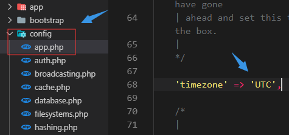

# Laravel实战

文章模块路由的实现

------

1. 创建控制器
2. 创建路由(增删改查)
3. 

`web.php`

```php
// 文章列表页
Route::get('/posts', '\App\Http\Controllers\PostController@index');
// 创建文章
Route::get('/posts/create', '\App\Http\Controllers\PostController@create');
Route::post('/posts', '\App\Http\Controllers\PostController@store');
//文章详情页
//编辑文章
//删除文章
```

文章模块的页面渲染

------

1. 创建文章

2. 编辑文章

3. 文章列表

4. 文章详情

   

文章模块的页面模板调整

------

1. 提取layout
2. 提取footer
3. 提取`nav`

文章模块数据表

------

1. 使用migrate创建数据表
2. 表名 posts
3. 外键 user_id
4. 时间 created_at / updated_at

文章模块模型

------

1. ORM
2. 创建  `posts`  的模型
3. `tinker`   的使用
4. 基本的增删改查

`修改时区`



## 文章模块

文章列表

- 模型查找
- 页面渲染
- [时间格式](https://carbon.nesbot.com/docs/)
- [数据填充](https://carbon.nesbot.com/docs/)
- 字符截断
- 分页

文章详情

- 控制器
- 路由兵丁
- 页面编写
- 列表页补充

添加文章逻辑

- 控制器
- `csrf`
- 保存model
- 验证和错误提示
- 错误提示本地化

编辑文章

- 

删除文章

## 登录，注册，评论，赞模块开发

页面搭建

------

- 登陆页面
  - 为什么不使用  `Auth`  组件？原因：一般来说前台的业务登录逻辑会比较复杂，用 `Auth` 组件修改起来就会非常复杂。所以在前台我们只使用 `Auth` 的管理类
- 注册页面
- 个人设置

业务逻辑

- 注册

  ```php
          //验证
          $this->validate(request(),[
              'name' => 'required|min:3|unique:users,name',
              'email' => 'required|unique:users,email|email',
              'password' => 'required|min:5|confirmed',
          ]);
  
          //逻辑
          $password = bcrypt(request('password'));
          $name = request('name');
          $email = request('email');
          $user = \App\User::create(compact('name', 'email', 'password'));
  
          //渲染
          return redirect('/login');
  ```

  

- 登录

- 用户授权Policy

  - 定义策略类
  - 注册策略类和模型关联
  - 策略判断

- 认证权限

  - 文章创建增加用户
  - 控制器
  - Layout
  - 文章编辑权限
  - 退出

- 头像设置

## 个人中心，专题模块搭建

## 后台模块搭建