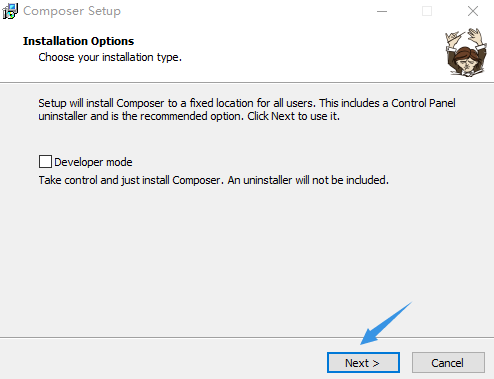
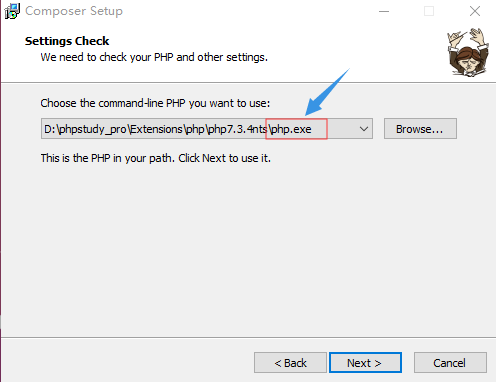
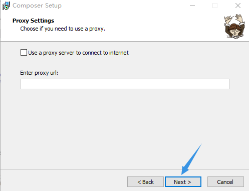
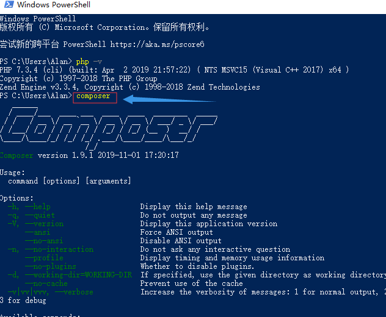

## Composer

#### [Composer官网](https://getcomposer.org/)

#### [Composer中国镜像](https://pkg.phpcomposer.com/)

### Composer命令行安装：

1. `方法1 下载并运行Composer- Setup.exe [优点:简单实现php和composer全局命令的配置]`
2. `方法2 下载composer.phar放在php目录中直接使用[优点:单一快捷使用composer`
3. `方法3  .php+archive`

### 安装-Windows 

### 1使用安装程序

这是在计算机上设置Composer的最简单方法。

下载并运行 [Composer-Setup.exe](https://getcomposer.org/Composer-Setup.exe)。它将安装最新的Composer版本并设置您的PATH，以便您可以`composer`从命令行中的任何目录调用。

