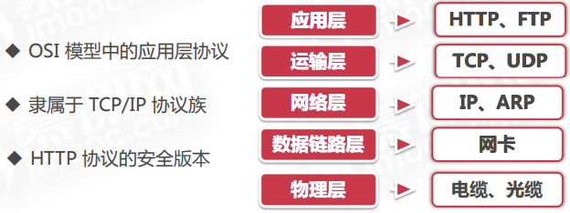
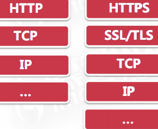
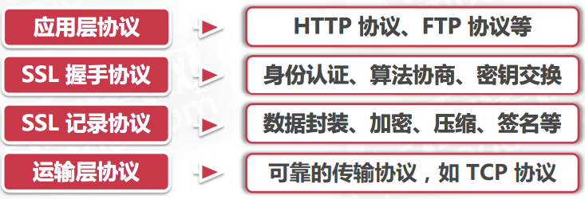
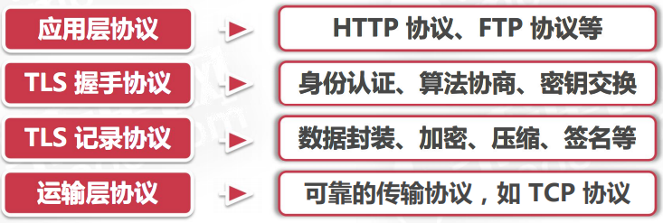
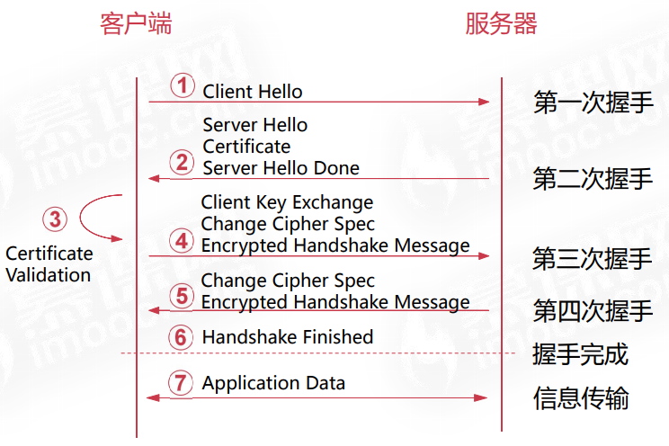
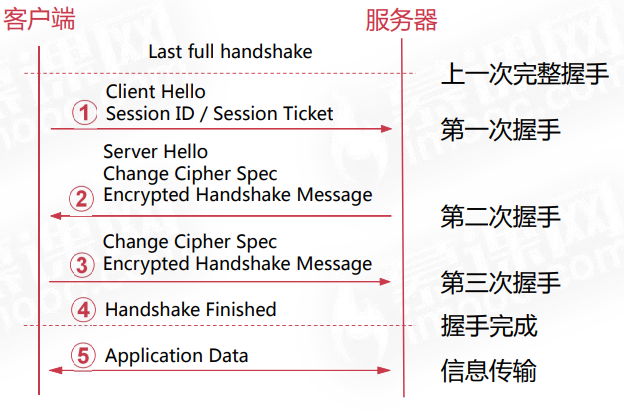

# HTTPS协议

## 什么是HTTPS协议一

- 超文本传输安全协议( Hypertext Transfer Protocol Secure )
- 也称HTTP over TLS、HTTP over SSL或HTTP Secure
- 通过计算机网络进行安全通信的传输协议

- HTTPS协议由两部分构成
- HTTP协议负责通信与传输
- 安全传输协议保证安全

- 默认端口443
- 提供网站服务器的安全认证
- 保护交换数据的隐私和安全性

## 什么是HTTPS协议二

### HTTPS协议与HTTP协议的相同点

1. 同属于TCP/IP协议族的应用层协议具有TCP协议面向连接、可靠传输、 流量控制等特点
2. 协议是无状态的需要通过COOKIE或SESSION等会话机制来保存状态
3. 请求与响应内容的格式相同，请求行+请求头+空行+请求数据&状态行+响应头+空行+响应数据
4. 广 泛用于互联网上的数据传输，支持B/S与C/S架构的应用

### HTTPS协议与HTTP协议的不同点

1. 协议头和默认端口不同https://example.com[:443] vs http://example.com[:80]
2. HTTPS协议需要使用安全证书安全证书由证书颁发机构( Certificate Authority ,简称CA )签发
3. 协议栈不同。HTTPS协议多了安全传输协议层
4. 资源消耗不同。HTTPS计算量大vs HTTP计算量少
5. 内容传输方式不同。HTTPS加密传输vs HTTP明文传输
6. 应用场景不同。HTTPS普通+特殊(安全、私密等)应用场景vs HTTP普通应用场景

### HTTPS协议的优势

1. 数据完整性。内容传输经过完整性校验
2. 数据私密性。内容经过对称加密,加解密秘钥具有唯一-性
3. 身份认证。第三方无法伪造服务端/客户端身份
4. 实用性强。提供安全、隐私的信息传输,应用场景丰富
5. 成本提高。增加证书购置成本、提高应用配置部署成本
6. 性能损耗。增加时延、消耗更多系统资源

## HTTPS协议原理

## HTTPS 协议发展历史 

严格地讲，HTTPS 并不是一个单独的协议，而是对工作 在一加密连接（SSL 或 TLS）之上的常规 HTTP 协议的 称呼。 HTTPS 协议的发展历史可以从 `HTTP 协议`与`安全传输协议的历史`两个方面阐述。 

##  HTTP 协议发展历史 

**HTTP/0.9** 

- 1991 年发布。主要规定了通信格式，不涉及数据包传输。客户端只有 GET 请求方法。服务端只能返回 HTML 格式的字符串内容 

 **HTTP/1.0** 

-  1996 年发布。引入了 POST 和 HEAD 请求方法。添加请求与响应中的头信息（HTTP header）。其他的新增功能还包括状态码、多字符集支持、多 部分发送、权限、缓存、内容编码等 

 **HTTP/1.1** 

-  1997 年发布。增加 Host 请求头字段，支持虚拟主机 。引入了 PUT、PATCH、OPTIONS 和 DELETE 请求方法 。其他的新增功能还包括持久连接、管道机制、分块传输等 

 **HTTP/2** 

-  2015 年发布。 完全的二进制协议。引入了多工、头信息压缩、服务器推送等新功能 

##  安全传输协议发展历史 

 **SSL 2.0** 

-  1995 年由 Netscape 公司设计并发布。  存在数个安全漏洞，容易遭受中间人攻击 。大部分浏览器均不再支持 

 SSL 3.0 

-  1996 年由 Netscape 公司完全重新设计并发布。相较前一版本安全性大大提高。  2014 年 Google 发现其设计缺陷，随后主流浏览器逐渐 放弃支持使用 SSL 3.0 协议 

 **TLS 1.0** 

-  1999 年 IETF 将 SSL 标准化（RFC 2246），在 SSL 3.0 的基础上设计并发布了 TLS 1.0 。 从技术上讲，TLS 1.0 和 SSL 3.0 的差异非常小 。 TLS 1.0 可以降级到 SSL 3.0，因此削弱了其安全性 

 **TLS 1.1** 

-  IETF 于 2006 年发布 TLS 1.1（RFC 4346）。  是 TLS 1.0 的更新版本 。 提高了安全性，添加对 CBC 攻击的保护 。 支持 IANA 登记的参数 

 **TLS 1.2** 

-  IETF 于 2008 年发布 TLS 1.2（RFC 5246） 。 基于 TLS 1.1 规范设计 。 使用了更加高效和安全的加密算法 

 **更多** 

-  TLS 所有版本在 2011 年 3 月发布的 RFC 6176 中删除 了对 SSL 的兼容 。 TLS 1.3 于 2018 年 3 月份成为建议标准的互联网草案 

##  传输层安全协议 

- 位于可靠的面向连接的运输层协议（TCP）和应用层协议（ HTTP）之间 。 通过互相认证确保不可冒充性，通过数字签名确保信息完整性、 通过加密确保私密性，以实现客户端和服务器之间的安全通讯 。 独立于应用协议，高层协议可以透明地分布在传输层安全协议之上
-  传输层安全协议主要有两种： SSL（Secure Sockets Layer）安全套接层 。 TLS（Transport Layer Security）传输层安全协议 

###  SSL 安全套接层 

1.  SSL 记录协议（SSL Record Protocol） 。建立在可靠的传输协议（如 TCP）之上，为高层协议（如 HTTP）提供数 据封装、加/解密、（解）压缩、签名及完整性校验等基本功能的支持。 
2.  SSL 握手协议（SSL Handshake Protocol） 。 建立在 SSL 记录协议之上，用于在实际的数据传输开始之前，通讯双方进 行身份认证、协商加密算法、交换加密密钥等。 

###  TLS 传输层安全协议 

- TLS 记录协议（TLS Record Protocol）。  建立在可靠的传输协议（如 TCP）之上，对数据进行加/解密、（解）压缩 签名、封装及完整性校验等操作。 
-  TLS 握手协议（TLS Handshake Protocol） 。 建立在 TLS 记录协议之上，使用公共密钥和证书处理用户认证，并协商算 法和加密实际数据传输的密钥。 

 **TLS 协议与 SSL 协议的比较** 

-  TLS 协议使用了更安全的 HMAC 算法，更强大的伪随机功能， 更严密的警报信息 。TLS 协议是基于 SSL 协议发展而来，从技术上讲，TLS 1.0 与 SSL 3.0 差异非常小 。TLS 协议比 SSL 协议更加复杂和安全，协议的规范更精确和完 善 。

 **TLS/SSL 安全传输通道** 

-  认证用户和服务器，确保数据发送到正确的客户机和服务器 。维护数据的完整性，确保数据在传输过程中不被篡改。 加密数据，以防止数据中途被窃取  

 **HTTPS 如何保证信息的安全传输** 

-  利用非对称加密方式对通信双方进行身份认证。 HTTPS 协议原理 要求客户端/服务器提供有效的数字证书等信息进行认证，可以防止通信双 方被冒充
-  利用非对称加密方式传输会话密钥 。 在私钥不失窃的情况下，保证会话密钥不能够被第三方破解获取
-  利用对称加密方式传输通信内容 。  在没有会话密钥的情况下，保证通信内容无法被第三方破解获取 
-  利用 MAC 算法对传输内容进行签名和校验 。 保证了通信内容的完整性和不可篡改 

##  四次握手 

`第一次握手` 

 **客户端发起连接请求 Client Hello** 

-  支持的安全传输协议 – SSLv2 SSLv3 TLSv1 TLSv1.1 TLSv1.2 
-  支持的加密套件 – 身份认证+密钥协商+信息加密+完整性校验 
-  支持的压缩算法 – 用于后续的信息压缩 
-  随机数 C – 用于后续密钥的生成 
-  扩展字段 – 协议或算法相关的辅助信息 

 `第二次握手` 

-  服务器返回协商的结果 Server Hello 

 选择使用的安全传输协议、加密套件和压缩算法 

 随机数 S – 用于后续密钥的生成 

-  服务器配置的证书链 Certificate 
-  服务器发送消息结束标志 Server Hello Done 
-  根据选择加密套件的不同，可能还会有其他的内容 

 `客户端证书校验` 

 **客户端对服务器返回的证书进行校验** 

-  证书链是否可信 – 能够被可信任的 CA 根证书验证合法性 
- 证书是否吊销
- 证书是否在有效期内 
- 证书域名与网站域名是否匹配 

 `第三次握手` 

-  客户端生成第三个随机数 Pre-master，并用证书公钥加密发送 给服务器 Client Key Exchange 。 客户端将通过随机数 C、随机数 S 和 Pre-master 计算出本次 会话的密钥 Key = fuc(C, S, Pre-master) 
-  客户端向服务器确认加密方式 Change Cipher Spec 
-  客户端计算前面所有消息的摘要值并加密发送给服务器 Encrypted Handshake Message 

 `第四次握手` 

-  服务器先通过私钥解密 Client Key Exchange 的内容，获取 Pre-master 的值并计算会话密钥 Key = fuc(C, S, Pre-master) 
-  服务器解密客户端发送的加密握手消息并校验 
-  服务器向客户端确认加密方式 Change Cipher Spec 
-  服务器计算当前所有消息的摘要值并加密发送给客户端 Encrypted Handshake Message 

 `握手完成 + 信息传输` 

-  客户端计算所有消息的摘要值并与服务器发送的加密握手消息做 校验 
-  校验通过则握手完成，无需向服务器发送任何消息 
-  客户端可以与服务器按照约定的协议版本、加密算法、会话密钥 等进行通信了 

 `双向认证` 

-  除了客户端验证服务器身份之外，服务器也可以要求验证客户端 的身份，即双向认证 
-  在第二次握手时，服务器向客户端发送 Client Certificate Request 信息，请求查看客户端证书 
-  在第三次握手时，客户端会同时发送 Client Certificate 和 Certificate Verify Message 给服务器 

 `四次握手中的加密算法` 

-  第三次握手中使用非对称加密算法加密 Pre-master 
-  第三次和第四次握手中使用 MAC 算法生成 Encrypted Handshake Message 
-  握手成功后使用对称加密算法加密通信数据 

##  TLS 会话缓存机制 

 `会话缓存` 

-  为了节省网络资源，提高 HTTPS 协议的工作效率，TLS 协议 中有两类会话缓存机制 。 会话标识 Session ID 。 会话记录 Session Ticket 

 `Session ID 缓存机制` 

-  在服务器端保存每次会话的 ID 和协商的通信信息 。 基本所有服务器都支持。 占用服务器资源多 。

 `Session Ticket 缓存机制` 

-  将协商的通信信息加密之后发送给客户端保存，解密的密钥由 服务器保存 。 服务器的支持范围有限 。 占用服务器资源少 

 `比较` 

-  Session ID 和 Session Ticket 类似于 Session 和 Cookie 。 两者都支持的情况下，应优先选择 Session Ticket 。 在 TLS 协议会话缓存中的作用是一样的 

 `会话缓存的优点` 

-  简化了握手过程，提高了建立握手的速度 。 减少了握手的信息传输，节省了带宽和流量 。 减少了计算量，节省了客户端和服务器的资源 

##  SSL 证书那些事儿 

###  SSL 证书的种类 

 `SSL 证书` 

-  SSL 证书的主要作用：身份认证和数据加密 。 向客户端证明服务器的真实身份，此真实身份是通过第三方权威 机构（CA）验证的 。 确保客户端和服务器之间的通信内容是高强度加密传输的，是不 可能被非法篡改和窃取的 

 `SSL 证书的分类` 

1.  域名验证型（DV）SSL 证书（Domain Validation SSL） 
2.  组织验证型（OV）SSL 证书（Organization Validation SSL） 
3.  扩展验证型（EV）SSL 证书（Extended Validation SSL） 

 `域名验证型（DV）SSL 证书` 

-  只验证网站域名所有权的简易型 SSL 证书 
-  仅能加密通信内容，不能向用户证明网站的真实身份 
-  适合无身份认证需求的网站使用，比如 Laravel China、Nginx 

 `组织验证型（OV）SSL 证书` 

-  需要验证域名所有权和所属单位的真实身份的标准型 SSL 证书 
-  不仅能加密通信内容，还能向用户证明网站的真实身份 

-  适合电子商务、企业等网站使用，比如亚马逊商城、海南航空 

 `扩展验证型（EV）SSL 证书` 

 遵循全球统一的严格身份验证标准颁发的 SSL 证书，是目前业 界最高安全级别的 SSL 证书 

 提供通信内容加密与网站身份证明，浏览器状态栏显示单位名称 

 适合金融证券、银行等网站使用，比如工商银行、陆金所 

 `SSL 证书的分类` 

-  单域型证书，仅支持单个域名 www.imooc.com 
-  多域型证书，支持多个域名 imooc.com, www.imooc.com 
-  通配型证书，支持带通配符的域名 *.imooc.com 

###  如何获取 SSL 证书 

1.  在供应商处购买 SSL 证书 
2.  在供应商处获取免费 SSL 证书 
3.  自行签发 SSL 证书 

