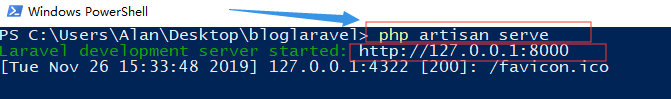
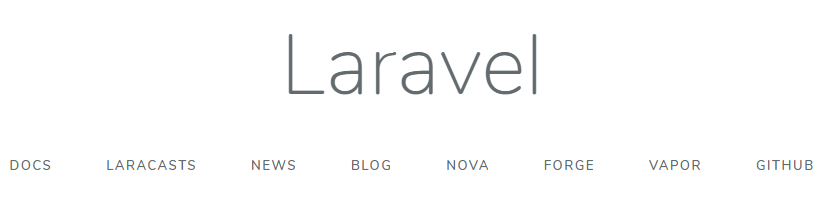

# Laravel

## Laravel安装

[5.4中文文档](https://learnku.com/docs/laravel/5.4)

### 安装 Laravel

Laravel 使用 [Composer](https://getcomposer.org/) 来管理代码依赖。所以，在使用 Laravel 之前，请先确认你的电脑上安装了 Composer。

### 通过 Laravel 安装工具

首先，使用 Composer 下载 Laravel 安装包：

```php
composer global require "laravel/installer"
```

请确定你已将 `~/.composer/vendor/bin` 路径加到 PATH，只有这样系统才能找到 `laravel` 的执行文件。

一旦安装完成，就可以使用 `laravel new` 命令在指定目录创建一个新的 Laravel 项目，例如：`laravel new blog` 将会在当前目录下创建一个叫 `blog` 的目录，此目录里面存放着新安装的 Laravel 和代码依赖。这个方法的安装速度比通过 Composer 安装要快上许多：

```php
laravel new blog
```

因为代码依赖是直接一起打包安装的。

### 通过 Composer Create-Project

除此之外，你也可以通过 Composer 在命令行运行 `create-project` 命令来安装 Laravel：

```php
composer create-project --prefer-dist laravel/laravel blog
```

### 本地开发服务器

如果你在本地安装了 PHP，你可能希望像运行 PHP 内置的开发服务器一样来访问自己的应用程序，你可以使用 `serve` Artisan 命令来启动一个本地开发服务器，这样你就可以在 `http://localhost:8000` 来访问它。

```php
php artisan serve
```

不过有更健壮的本地开发选项可用，比如 [Homestead](https://learnku.com/docs/laravel/5.4/homestead) 和 [Valet](https://learnku.com/docs/laravel/5.4/valet)。





配置

------

`入口目录`

在安装 Laravel 之后，你需要配置你的 Web 服务器的根目录为 `public` 目录。 这个目录的 `index.php` 文件作为所有 HTTP 请求进入应用的前端处理器。

`配置文件`

Laravel 框架所有的配置文件都存放在 `config` 目录下。每个选项都被加入文档

## 核心概念

### HTTP层

路由：

 构建最基本的路由只需要一个 URI 与一个 `闭包`，这里提供了一个非常简单优雅的定义路由的方法： 

```php
Route::get('foo', function () {
    return 'Hello World';
});
```

默认路由文件：

在 `routes/web.php` 文件中定义你的 web 页面路由。  。定义在 `routes/api.php` 中的路由都是无状态的，并且会应用 `api` 中间件组。 


### 可用的路由方法

```php
Route::get($uri, $callback);//获取资源
Route::post($uri, $callback);//创建资源
Route::put($uri, $callback);//更新资源
Route::patch($uri, $callback);//增量更新资源
Route::delete($uri, $callback);//删除资源
Route::options($uri, $callback);//查阅资源支持哪些方法
```

 有的时候你可能需要注册一个可响应多个 HTTP 方法的路由，这时你可以使用 `match` 方法，也可以使用 `any` 方法注册一个实现响应所有 HTTP 的请求的路由： 

```php
Route::match(['get', 'post'], '/', function () {
    //
});
Route::any('foo', function () {
    //
});
```

### 路由参数

 有时我们需要在路由中捕获一些 URL 片段。例如，我们需要从 URL 中捕获用户的 ID ，我们可以这样定义路由参数： 

```php
Route::get('user/{id}', function ($id) {
    return 'User '.$id;
});
```

 也可以根据需要在路由中定义多个参数： 

```php
Route::get('posts/{post}/comments/{comment}', function ($postId, $commentId) {
    //
});
```

 路由的参数通常都会被放在 `{}` 内，并且参数名只能为字母，当运行路由时，参数会通过路由闭包来传递。 

::: tip

  路由参数不能包含 `-` 字符。请用下划线 (`_`) 替换。 

:::

### 路由组

常见的分组方式

- `前缀分组`。`命名空间分组`。`中间件分组`。

 路由组允许共享路由属性，例如中间件和命名空间等，我们没有必要为每个路由单独设置共有属性，共有属性会以数组的形式放到 `Route::group` 方法的第一个参数中。 

`中间件`

要给路由组中定义的所有路由分配中间件，可以在路由组中使用 `middleware` 键，中间件将会依照列表内指定的顺序运行：

```php
Route::group(['middleware' => 'auth'], function () {
    Route::get('/', function ()    {
        // 使用 `Auth` 中间件
    });
    Route::get('user/profile', function () {
        // 使用 `Auth` 中间件
    });
});
```

`命名空间`

另一个常见的例子是，为控制器组指定公共的 `PHP` 命名空间。这时使用 `namespace` 参数来指定组内所有控制器的公共命名空间：

```php
Route::group(['namespace' => 'Admin'], function () {
    // 在 "App\Http\Controllers\Admin" 命名空间下的控制器
});
```

 请记住，默认 `RouteServiceProvider` 会在命名空间组中引入你的路由文件，让你不用指定完整的 `App\Http\Controllers` 命名空间前缀就能注册控制器路由，因此，我们在定义的时候只需要指定命名空间 `App\Http\Controllers` 以后的部分。 

`路由前缀`

通过路由组数组属性中的 `prefix` 键可以给每个路由组中的路由加上指定的 URI 前缀，例如，我们可以给路由组中所有的 URI 加上路由前缀 `admin` : 

```php
Route::group(['prefix' => 'admin'], function () {
    Route::get('users', function ()    {
        // 匹配包含 "/admin/users" 的 URL
    });
});
```


### 获取请求参数

 利用路由指定参数 

-  在 Route 中使用 `{value}` 格式规定必传参数 

-  在控制器中可以直接当做 入参 来获取参数值 

-  可以使用 `{value？}` 格式规定可选参数

### 控制器

-  自动生成增删改以及符合 RESTful 规范的路由 
-  在 Artisan 中生成控制器时加入 `--resource` 参数  
-  在路由中使用 `Route::resources()` 生成配套资源路由 

###  控制器中每个方法的意义 

- `index()` 展示所有资源信息 
- `create()` 展示创建表单 
- `store()` 处理创建表单的数据 并整理入库 
- `show()` 展示单个资源信息 
-  `edit()` 展示编辑表单 
-  `update()` 收集更新表单中的数据 并整理入库 
-  `delete()` 删除资源信息 

自定义资源路由 

- 使用 `only` 关键字指定白名单 。 使用 `expect` 关键字指定白名单 

## 中间件 Middleware 

什么是中间件？

Laravel 中间件提供了一种方便的机制来`过滤进入应用的 HTTP 请求`，例如，Laravel 包含验证用户身份权限的中间件。如果用户没有通过身份验证，中间件会重定向到登录页，引导用户登录。反之，中间件将允许该请求继续传递到应用程序。

当然，除了身份验证以外，中间件还可以被用来执行各式各样的任务，如：CORS 中间件负责为所有即将离开应用的响应添加适当的头信息；日志中间件可以记录所有传入应用的请求。

Laravel 已经内置了一些中间件，包括身份验证、CSRF 保护等。所有的中间件都放在 `app/Http/Middleware` 目录内。

### 创建中间件

```
php artisan make:middleware CheckAge
```

 该命令将会在 `app/Http/Middleware` 目录内新建一个 `CheckAge` 类。在这个中间件内，我们仅允许请求的 `age` 参数小于 200 时访问该路由，否则，会将用户请求重定向到 `home` URI 。 

```php
<?php
namespace App\Http\Middleware;
use Closure;
class CheckAge
{
    /**
     * 处理传入的请求
     *
     * @param  \Illuminate\Http\Request  $request
     * @param  \Closure  $next
     * @return mixed
     */
    public function handle($request, Closure $next)
    {
        if ($request->age <= 200) {
            return redirect('home');
        }
        return $next($request);
    }
}
```

如你所见，若请求参数 `age` 小于等于 `200`，中间件将返回给客户端 HTTP 重定向，反之应用程序才会继续处理该请求。若将请求继续传递到应用程序（即允许通过中间件验证），只需将 `$request` 作为参数调用 `$next` 回调函数。

最好将中间件想象为一系列的`「层」`，HTTP 请求必须经过它们才会触发您的应用程序。每一层都可以检测接收的请求，甚至可以完全拒绝请求访问您的应用。

### 视图

```php
使用 view() 返回视图 接受两个参数 路径和数据
在视图中使用 {{ $varname }} 来展示数据
在视图中使用 {{ $varname }} 来展示数据
```

视图的用途是用来存放应用程序中 HTML 内容，并且能够将你的控制器层`（或应用逻辑层）`与展现层分开。视图文件目录为 `resources/views` ，示例视图如下： 

```php
<html>
    <body>
        <h1>Hello, {{ $name }}</h1>
    </body>
</html>
```

 上述视图文件位置为 `resources/views/greeting.blade.php` ，  通过全局函数 `view` 来使用这个视图，如下： 

```php
Route::get('/', function () {
    return view('greeting', ['name' => 'James']);
});
```

 如你所见，`view` 函数中，第一个参数是 `resources/views` 目录中视图文件的文件名，第二个参数是一个数组，数组中的数据可以直接在视图文件中使用。在上面示例中，我们将 `name` 变量传递到了视图中，并在视图中使用 [Blade 模板语言](https://learnku.com/docs/laravel/5.4/blade) 打印出来。 


## 前端

`Blade模板`

Blade 是 Laravel 提供的一个既简单又强大的模板引擎。和其他流行的 PHP 模板引擎不一样，Blade 并不限制你在视图中使用原生 PHP 代码。所有 Blade 视图文件都将被编译成原生的 PHP 代码并缓存起来，除非它被修改，否则不会重新编译，这就意味着 Blade 基本上不会给你的应用增加任何额外负担。Blade 视图文件使用 `.blade.php` 扩展名，一般被存放在 `resources/views` 目录。

### 模板继承

先通过一个简单的例子来上手。首先，我们需要确认一个 "master" 的页面布局。因为大多数 web 应用是在不同的页面中使用相同的布局方式，我们可以很方便的定义这个 Blade 布局视图：

```php
<!-- 文件保存于 resources/views/layouts/app.blade.php -->

<html>
    <head>
        <title>应用程序名称 - @yield('title')</title>
    </head>
    <body>
        @section('sidebar')
            这是 master 的侧边栏。
        @show

        <div class="container">
            @yield('content')
        </div>
    </body>
</html>
```

请注意 `@section` 和 `@yield` 命令。 `@section` 命令正如其名字所暗示的一样是用来`定义一个视图区块`，而 `@yield` 指令是用来`显示指定区块的内容`。接着来定义一个继承此布局的子页面

`继承页面布局`

------

使用 Blade 提供的 `@extends` 命令来为子页面指定其所 `「继承」` 的页面布局。 当子页面继承布局之后，即可使用 `@section` 命令将内容注入于布局的 `@section` 区块中。`布局中使用 @yield 的地方将会显示这些区块中的内容`

```php
<!-- Stored in resources/views/child.blade.php -->

@extends('layouts.app')

@section('title', 'Page Title')

@section('sidebar')
    @parent

    <p>This is appended to the master sidebar.</p>
@endsection

@section('content')
    <p>This is my body content.</p>
@endsection
```

`sidebar` 区块利用了 `@parent` 命令追加布局中的 sidebar 区块中的内容，如果不使用则会覆盖掉布局中的这部分内容。 `@parent` 命令会在视图被渲染时替换为布局中的内容。

### 创建一个布局文件

```php
//步骤
定义一个名为 layout.blade.php 的主布局文件
定义多个子视图文件，如 菜单、头部页脚等
在其他视图中继承布局文件
  
  
//相关语法
@section 定义视图的局部内容 使用 @show 结尾
@yield 定义指定部分的内容
@extends 继承主视图模板
@parent 引用 @section 中的内容且不覆盖
在子视图中的 @section 标签要以 @endsection 标签来结尾
@section 可以独写一行 也可以定义一部分区域  
```


### 常见 Blade 语法

`普通输出`

------

```php
{{ $varName }}   输出一个经过转义的变量

{!! $varName !!}    输出变量的原始值

@{{ $varName }}   保持表达式不变

@json()   直接输出 json 表达式

@verbatim   输出大段原始表达式
```


`流程控制表达式`

------

```php
@if() @else() @elseif() 和 @endif()

@unless() 便捷表达式

@isset() 和 @empty()

@switch() @case @break @default 和 @endswitch

@auth() 和 @guest() 认证表达式

@hasSection() 和 @endif() 判断 section 是否存在

@for 和 @endfor

@foreach() 和 @endforeach()

@forelse() 、 @empty() 和 @endforelse()

@while()
```


`其他表达式`

------


```php
@php 和 @endphp 直接运行 PHP 代码
{{-- --}}  模板注释 结果不会展示在最终输出的 HTML 中
```

## 数据库

### Laravel 的数据库迁移 Migrations

Laravel 的 `Schema` [facade](https://learnku.com/docs/laravel/5.4/facades) 对所有 Laravel 支持的数据库系统提供了创建和操作数据表的相应支持。

使用 `make:migration` [Artisan 命令](https://learnku.com/docs/laravel/5.4/artisan) 来创建迁移：

```
php artisan make:migration create_users_table
```

新的迁移文件将会被放置在 `database/migrations` 目录中。每个迁移文件的名称都包含了一个`时间戳`，以便让 Laravel 确认迁移的顺序。

`--table` 和 `--create` 选项可用来指定数据表的名称，或是该迁移被执行时会创建的新数据表。这些选项需在预生成迁移文件时填入指定的数据表：

### Laravel 中操作数据库

1. 使用原生SQL语句
2. 查询构造器
3. Eloquent ORM

`原生 SQL`

使用 `DB::select()` `DB::insert()` `DB::update()` `DB::delete()`。

### 查询构造器

`查询数据`

- 语法 `DB::table()` 指定数据库
- 使用 `where()` 加入条件
- 使用 `get()` 或 first() 取多条或一条数据
- `count()`    `max()`    `min()`   `avg()`   `sum()` 统计数据
- 使用 `exists()` 或 doesntExtist() 判断数据是否存在
- 使用 `DB::raw()` 加入原生 SQL 语句
- 使用 `join()` 进行关联表查询
- `orderby()` 传递 字段 和 排序方式 进行排序
- `groupBy()` 和 `having()` 对查询结果进行分组

`插入数据`

- 使用  `insert()`  插入一条或多条数据
- 传递数组即为批量插入
- 使用  `insertGetId()`  获取自增主键的ID值

`更新数据`

- 使用  `update()`  更新指定的数据
- `increment()`  和  decrement() 自增/自减 字段的值

`删除数据`

- 使用  `delete()`  删除指定的数据
- 使用  `truncate()`  清空表

### 数据填充

`生成一个 Seeder`

Laravel 可以用 seed 类轻松地为数据库填充测试数据。所有的 seed 类都存放在 `database/seeds` 目录下。你可以任意为 seed 类命名，但是应该遵守类似 `UsersTableSeeder` 的命名规范。Laravel 默认定义了一个 `DatabaseSeeder` 类。可以在这个类中使用 `call` 方法来运行其它的 seed 类来控制数据填充的顺序。

```
php artisan make:seeder UsersTableSeeder
//生成一个 Seeder
```

- 在 `run()` 方法内定义需要填充的数据
- 运行 `php artisan db:seed` 命令 填充数据

一个 seeder 类只包含一个默认方法：`run`。这个方法在 `db:seed` [Artisan 命令](https://learnku.com/docs/laravel/5.4/artisan) 被调用时执行。在 `run` 方法里你可以为数据库添加任何数据。你也可以用 [查询语句构造器](https://learnku.com/docs/laravel/5.4/queries) 或 [Eloquent 模型工厂](https://learnku.com/docs/laravel/5.4/database-testing#writing-factories) 来手动添加数据。

## ORM

Laravel 的 Eloquent ORM 提供了漂亮、简洁的 ActiveRecord 实现来和数据库进行交互。每个数据库表都有一个对应的`「模型」`可用来跟数据表进行交互。你可以通过模型查询数据表内的数据，以及将记录添加到数据表中。

在开始之前，请确认你已在 `config/database.php` 文件中设置好了数据库连接。更多数据库的设置信息请查看 [数据库设置](https://learnku.com/docs/laravel/5.4/database#configuration) 文档。

