## Redis1

### **Redis介绍**

- Redis是Key-Value型NoSQL数据库
- Redis将数据存储在内存中,同时也能持久化到磁盘
- Redis常用于缓存,利用内存的高效提高程序的处理速度

**特点**

- 速度快。广泛的语言支持。持久化。多种数据结构。主从复制。分布式与高可用。

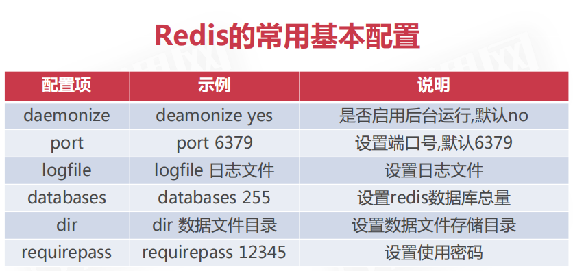

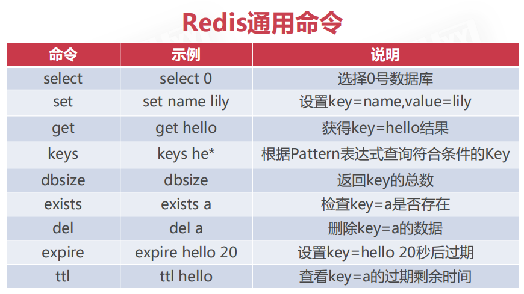

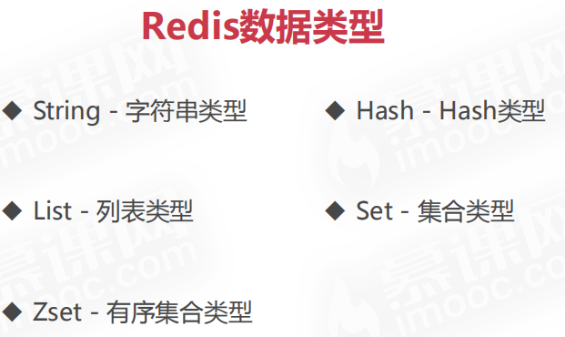

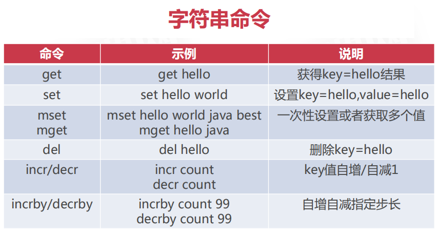

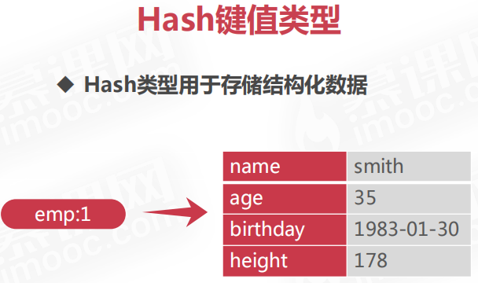

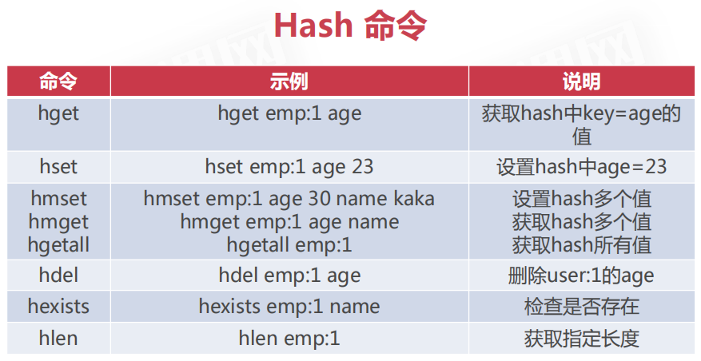

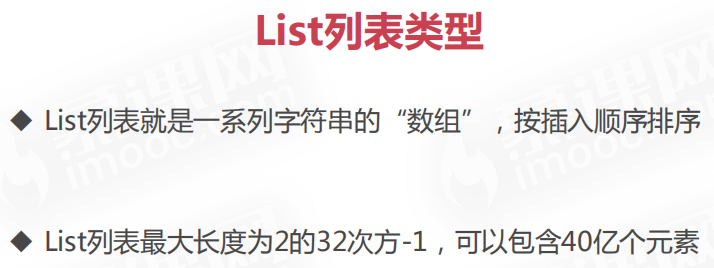

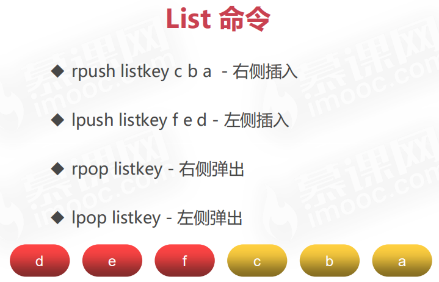

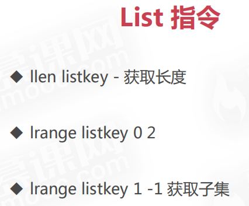

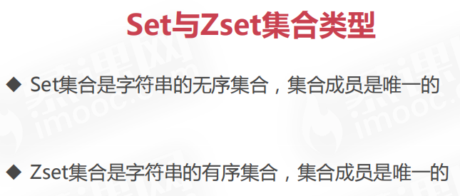

### 在Windows平台安装Redis

[下载地址]( https://github.com/microsoftarchive/redis/releases )

 redis-server redis.windows.conf 

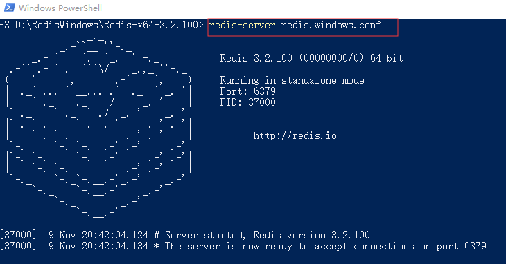

