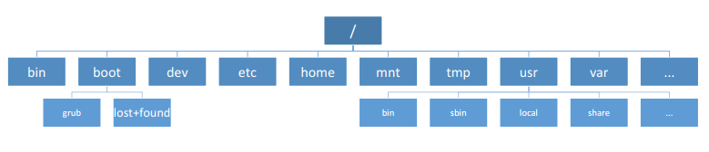
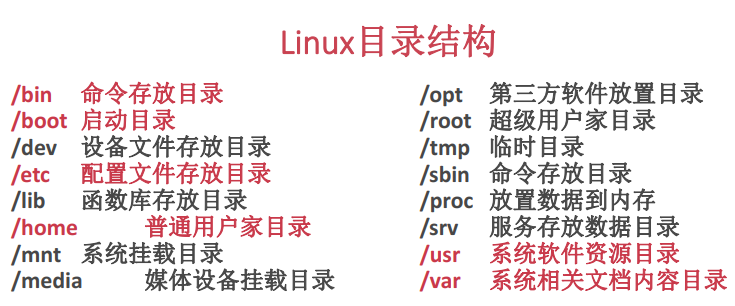
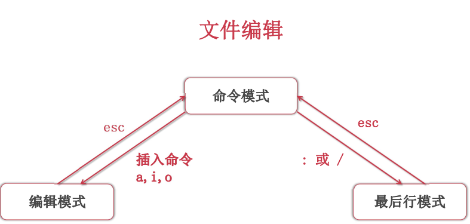

## linux基础

**Linux命令格式**：

- 命令[选项] [参数1] [参数2]。例如:`Is`    `-|`    `/`
- 关机：`shutdown -h now` 
- 重启：`shutdown -r now` 或 reboot

**使用 ls 命令查看目录结构**

- 目录查看：Is [-al] [文件或目录名称]
- 目录切换：cd [目录名称]
- 显示当前目录： pwd
- 目录创建：mkdir[-p]目录名称
- 目录删除：rmdir [-p]目录名称
- 创建文件：touch文件名

**文件查看**：cat/more/less/head/tai/...

- 复制：cp [-r] 来源文件目标文件
- 移动：mv来源文件目标文件
- 删除：rm [-rf] 文件或目录

**查找**

- 查找命令：which命令名
- 特定目录查找：whereis文件或目录
- 查找：find目录[-name/user/size] 参数

**用户管理**

- 创建用户：useradd [-g 群组]用户名
- 设置密码：passwd用户名
- 删除用户：userdel[-r]用户名

**群组管理**

- 查看群组：groups [用户名]
- 创建群组：groupadd群组名
- 删除群组：groupdel群组名
- 用户群组修改：usermod [g群组名]用户名

