vue

## Vue​ :hammer:

### 挂载点（el）

```js
el：挂载点//用来设置Vue实例挂载(管理)的元素
data：数据对象
{{ message }}：插值表达式
```

```html {1}
<!-- div标签就是挂载点 -->
<div id="app" class="app">
  {{ message }} 
  <span> {{ messsage }} </span>
</div>
```

```js {2,7}
var app = new Vue({    
  el:".app",//el 就是 Element
  //el: '#app',
  //el:"div",
  //可以使用其他的选择器
template:'<h1>hellp {{msg}} </h1>',
//模板指的就是挂载点内部的内容，模板也可以写在template属性中
  data: {
    message: 'Hello Vue!',
    msg:'world'
  }
})
```

Vue实例的作用范围是什么呢？

- Vue会管理el选项 `命中的元素` 及其内部的 `后代元素`

是否可以设置其他的dom元素呢？

- 可以使用其他的双标签，不能使用HTML和body

### 数据对象（data）

```html
  <div id="app">
    <h2> {{person.name}} </h2>
    <ul>
      <li>{{ personal[2] }} </li>
    </ul>
  </div>
```

```js
    var app = new Vue({
      el: '#app',
      data: {
        person:{
          name:"TimSpan",
          mobile:"17346625362"
        },
        personal:["Geek","Thinker","Developer"]
      }
    })
```

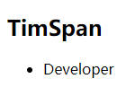

::: tip data数据对象

1. Vue中的数据定义在data中
2. data中可以写复杂类型的数据
3. 渲染复杂类型数据时，遵守js的语法即可

:::


### 指令（基本指令）

```js
//内容绑定，事件绑定
v-text,v-html,v-on
//显示切换，属性绑定
v-show,v-if,v-bind
//列表循环，表单元素绑定
v-for,v-on,v-model
```

`v-text`

------

```html
  <div id="app">    
    <h2 v-text="message+'!'">Tokyo </h2>
    <h2>{{message+'!'}}Tokyo </h2>
  </div>
```

```js
    var app = new Vue({
      el: '#app',
      data: {
        message:"TimSpan",
      }
    })
```

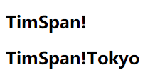

::: tip v-text

1. `v-text` 指令的作用：设置标签的内容(textContent)
2. 默认写法会替换全部内容，使用差值表达式可以替换指定内容
3. 内部支持写表达式

:::

`v-html`

------

`设置标签的innerHTML`

```html
  <div id="app">    
    <p v-html="content"></p>
    <p v-text="content"></p>
  </div>
```

```js
    var app = new Vue({
      el: '#app',
      data: {
        content:"<a href='https://timspan.github.io/documents/'>TimSpan</a>"
      }
    })
```

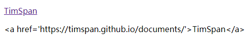

::: tip v-html

内容中的html结构会被解析为标签

:::

`v-on基础`

------

`为元素绑定事件`。JS中比如 `onclick`

```html {5}
  <div>
    <input type="button" value="事件绑定" v-on:事件名="方法">
    <input type="button" value="事件绑定" v-on:click="doit">
    <input type="button" value="事件绑定" @click="doit">
    //缩写@click
  </div>
```

```js {1}
//方法写在vue实例methods属性中
    var app = new Vue({
      el: '#app',
      methods: {
        doit:function(){
          //逻辑
        }
      },
    })
```

```html
<h2 @click="changefood">{{food}} </h2>
```

```js {9}
    var app = new Vue({
      el: '#app',
      data:{
        food:"流体蛋包饭"
      },
      methods: {        
        changefood:function(){
          this.food+="好好吃！"
          //通过this关键字可以点出定义在data中的数据
        }        
      },
    })
```

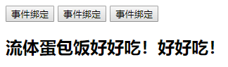

::: tip v-on基础

1. 事件名不需要写 `on`，指令可以简写为 `@`
2. 绑定的方法定义在 `methods` 属性中
3. 方法内部通过 `this关键字` 可以访问定义在data中的数据

:::


`v-show`

------

`根据真假切换元素的显示状态`

::: tip v-show

- 原理是修改元素的 `display` 实现显示隐藏
- 指令后面的内容，最终都会解析为 `布尔值`
- 数据改变后，对应元素的显示状态会 `同步更新`

:::

`v-if`

------

```html
<input type="button" value="切换显示" @click="toggleisshow">
<p v-if="isShow">Tim is a Developer</p>
<p v-show="isShow">Tim is a Thinker</p>
<h2 v-if="temperature>=35">热死啦</h2>
```

```js
    var app = new Vue({
      el: '#app',
      data:{
        isShow:false,
        temperature:40
        //支持表达式
      },
      methods: {        
        toggleisshow:function(){
          this.isShow=!this.isShow;
        }        
      },
    })
```

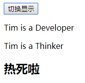

`根据真假切换元素的显示状态`

::: tip v-if

- 本质是通过操纵 `dom` 元素来切换显示状态
- 表达式的值为 `true` ，元素存在于 `dom` 树中，为 `false` ，从 `dom` 树中移除
- 频繁的切换 `v-show` ，反之 `v-if` ，前者的切换消耗小

:::

`v-bind`

------

`为元素绑定属性`

- 完整写法 `v-bind:属性名`。简写省略v-bind 保留 `:属性名`

- 需要动态的增删 `class` 建议使用对象的方式

```css
    .active{
      border: 1px solid red;
    }
```

```html


```

::: tip :class="{active:isActive}"

`active` 这个类名是否生效取决于  `isActive的值`

:::

```js
    var app = new Vue({
      el: '#app',
      data:{
        imgSrc:"https://timspan.github.io/documents/composer.png",
        isActive:false
      },
      methods: {        
        toggleActive:function(){
          this.isActive=!this.isActive;
        }        
      },
    })
```


`v-for`

------

`根据数据生成列表结构`

```html
    <input type="button" value="添加数据" @click="add">
    <input type="button" value="移除数据" @click="remove">
    <ul>
      <li v-for="(item,index) in person">
        {{index+1}}person:{{item}}
      </li>      
    </ul>
    <h2 v-for="item in vegetables">
      {{item.name}}
    </h2>
```

```js
    var app = new Vue({
      el: '#app',
      data:{
        person:["小明","小花","小红","小姐姐"],
        vegetables:[
          {name:"西兰花炒蛋"},
          {name:"蛋炒西兰花"},
        ]
      },
      methods: {        
        add:function(){
          this.vegetables.push({name:"花菜炒蛋"});
        },
        remove:function(){
          this.vegetables.shift();
        }           
      },
    })
```

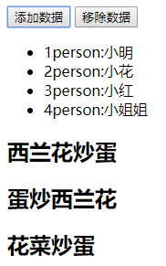

::: tip v-for 

- 数组经常和 `v-for` 结合使用
- 语法是 `(item,index) in 数据`
- item 和 index 可以结合其他指令一起使用
- 数组长度的更新会同步到页面上，是响应式的

:::

`v-on补充`

------

`传递自定义参数，事件修饰符`

::: tip v-on补充

- 事件绑定的方法写成 `函数调用` 的形式，可以传入自定义参数
- 定义方法时需要定义 `形参` 来接收传入的实参
- 事件的后面跟上 `.修饰符` 可以对事件进行限制
- `.enter` 可以限制触发的按键为回车

:::

### 指令的本质是什么？

::: warning 指令的本质是什么？

其实指令没什么神秘的地方，更多的也只是 `语法糖`，说直白一点其实就是一个 `标志位`。

:::

### 双向数据绑定（v-model）

------

`便捷的获取和设置表单元素的值` 

::: tip 双向绑定 or 单向数据流

- Vue是单向数据流，不是双向绑定
- Vue的双向绑定不过是 `语法糖`
- `Object.defineProperty` 是用来做 `响应更新` 的，和双向数据绑定没关系

:::


::: tip 双向数据绑定

双向指的是 `更改` 两边的任何一边都会同步 `更新对方的值`

- 绑定的数据会和表单元素相关联
- 绑定的数据<---->表单元素的值

:::

```html
<input type="text" v-model="message">
<h2>{{message}} </h2>
```

```js
    var app = new Vue({
      el: '#app',
      data:{
        message:"Tim is a good man "
      },
    })  
```

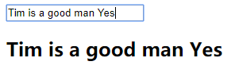

### 计算属性和侦听器

::: tip 计算属性 computed

`说白一点你可以理解为：可以在里面写一些计算逻辑的属性`

1. 减少模板中计算逻辑
2. 数据缓存
3. 依赖固定的数据类型(响应式数据)

:::

::: tip 侦听器 watch

1. watch 中可以执行任何逻辑，如函数节流，Ajax异步获取数据，甚至操作DOM

:::

::: tip computed VS watch

1. computed能做的，watch都能做，反之则不行
2. 能用 computed 尽量用 computed

:::

### 目录结构

| 目录/文件    | 说明                                                         |
| :----------- | :----------------------------------------------------------- |
| build        | 项目构建(webpack)相关代码                                    |
| config       | 配置目录，包括端口号等。我们初学可以使用默认的。             |
| node_modules | npm 加载的项目依赖模块                                       |
| src          | 这里是我们要开发的目录，基本上要做的事情都在这个目录里。里面包含了几个目录及文件：<br /><br />`assets:` 放置一些图片，如logo等。<br />`components:` 目录里面放了一个组件文件，可以不用。<br />`App.vue: 项目入口文件，`我们也可以直接将组件写这里，而不使用 components 目录。<br />`main.js: 项目的核心文件。` |
| static       | 静态资源目录，如图片、字体等。                               |
| test         | 初始测试目录，可删除                                         |
| .xxxx文件    | 这些是一些配置文件，包括语法配置，git配置等。                |
| `index.html` | `首页入口文件`，你可以添加一些 meta 信息或统计代码啥的。     |
| package.json | 项目配置文件。                                               |
| README.md    | 项目的说明文档，markdown 格式                                |

### 条件渲染


### 列表渲染

## 组件基础 🔨

```js {1,4}
// 组件名就是 Vue.component 的第一个参数
Vue.component('button-counter', {
  data: function () {
    //data必须是一个函数
    return {
      count: 0
    }
  },
  template: '<button v-on:click="count++">You clicked me {{ count }} times.</button>'
})
```

::: warning 把组件作为自定义元素来使用

组件是可复用的 Vue 实例，且带有一个名字：在这个例子中是  <button-counter>  。我们可以在一个通过 `new Vue `创建的 Vue 根实例中，把这个组件作为 `自定义元素` 来使用：

:::

::: warning 组件是可复用的 Vue 实例

`因为组件是可复用的 Vue 实例`，所以它们与 `new Vue` 接收相同的选项，例如 `data`、`computed`、`watch`、`methods` 以及生命周期钩子等。仅有的例外是像 `el` 这样根实例特有的选项。

:::

```html {1}
<div id="components-demo">
  <button-counter></button-counter>
</div>
```

```js
    new Vue({
       el: '#components-demo' 
    })
```


### 组件的注册类型（全局和局部）

::: warning 全局注册

可以用在任何新创建的 Vue 根实例 (`new Vue`) 的模板中

:::

::: warning 局部注册

局部注册的组件在其子组件中不可用

:::

可以通过一个普通的 JavaScript 对象来定义局部组件：

```js
var ComponentA = { /* ... */ }
var ComponentB = { /* ... */ }
```

然后在 `components` 选项中定义你想要使用的组件：


```js {4，5}
new Vue({
  el: '#app',
  components: {
    'component-a': ComponentA,
    'component-b': ComponentB
  }
})
```

对于 `components` 对象中的每个属性来说，其属性名就是 `自定义元素的名字` ，其属性值就是这个组件的 `选项对象` 。

```html {3,13}
<body>
  <div id="app">
    <counter-a></counter-a>
  </div>
  <script src="https://cdn.jsdelivr.net/npm/vue/dist/vue.js"></script>
  <script>
    var counter = {
      template: '<div>0</div>'
    }
    var app = new Vue({
      el: '#app',
      components:{
        'counter-a': counter //属性名就是自定义元素的名字，属性命名需遵循规范
      }
    })  
  </script>
</body>
```

### 非父子组件通信

::: tip 

非父子组件间传值(Bus/总线/发布订阅模式/观察者模式)

:::

首先 new 一个 Vue 的实例，然后赋值给 `Vue.prototype.bus`，

::: tip

往 `Vue.prototype`上挂载 `bus`属性，这个属性指向 Vue 实例。之后调用 `new Vue()` 或者创建组件的时候每个组件上都会有 `bus`这个属性。每个组件都是 `Vue` 这个类创建的，而这个类上挂了一个 `bus` 属性

:::

```html
  <div id="app">
    <child content="Tim"></child>
    <child content="Span"></child>
  </div>
```


```js {1,11,12,16}
    Vue.prototype.bus = new Vue()

    Vue.component('child',{
      props:{
        content: String
      },
      template: '<div @click="handleClick">{{content}} </div>',
      methods: {
        handleClick:function(){
          this.bus.$emit('change', this.content)
          //这个bus同时又是Vue的实例，所以有$emit方法,
          //再通过$emit向外触发事件，同时携带数据
        }        
      },
      mounted: function () {
        //function作用域改变了，把this做个保存
        var this_ = this
        this.bus.$on('change', function (msg) {
          this_.content = msg
        })
      }
    })

    var app = new Vue({
      el: '#app'
    }) 
```

**子组件不能修改父组件传递过来的值**，代码修改如下：


```js {4,10,13,19}
    Vue.component('child',{
      data:function() {
        return {
          selfContent: this.content//拷贝
        }
      },
      props:{
        content: String
      },
      template: '<div @click="handleClick">{{selfContent}} </div>',
      methods: {
        handleClick:function(){
          this.bus.$emit('change', this.selfContent)
        }        
      },
      mounted: function () {
        var this_ = this
        this.bus.$on('change', function (msg) {
          this_.selfContent = msg
        })
      }
    })
```


### 父子组件通信

::: warning 父子组件通信

1. 父组件能向子组件传递任何类型的值，父组件通过 `属性的形式` 向子组件传递数据，子组件通过`props`属性接受。
2. 子组件不能修改父组件传递过来的值，子组件通过 `事件的形式` 向父组件传值，子组件通过`this.$emit()`方法向父组件派发事件，并且这个事件可以携带参数或者多个参数。

:::

### 组件使用细节

::: warning is解决标签正确嵌套的问题

当在使用一些特定的标签中嵌套组件的时候，有时候可能报错，这个时候可以给组件添加`is`属性来解决

:::

::: warning ref  引用

在某些情况下，我们不得不选择操作DOM，`Vue`提供了`ref`特性来让我们直接操作DOM。`ref`在不同的情况下，有不同的返回结果：

1. 在普通的标签上，它返回元素标签本身
2. 在组件上，它返回组件的引用

:::

## 组件的核心概念​ :hammer:


### 属性

```js {2}
Vue组件 = Vue实例 = new Vue(options)
//不同的组件只是 options 的不同，大部分工作都是围绕在配置 options
```

::: tip 自定义属性 props

组件 `props` 中声明的属性

:::

::: tip 原生属性 attrs

没有声明的属性，默认挂载到组件根元素上，设置 `inheritAttrs` 为 `false` 可以关闭自动挂载

:::

::: tip 特殊属性 class style

挂载到组件根元素上，支持 `字符串`，`对象`，`数组` 多种语法

:::

### 事件

::: tip 事件

- 普通事件
  - @click , @input , @change 等事件，通过 `this.$emit('xxx',...)` 触发
- 修饰符事件
  - @input.trim , @click.stop , @submit.prevent 等，一般用于HTML元素,自定义组件需要自行开发支持

:::

::: warning this.$emit('xxx',...) 的返回值是什么？

返回值就是this,如果需要返回值可以使用回调函数

:::

### 插槽

::: tip 普通插槽

- 2.5版本

  - ```html
    <template slot="xxx">...</template>
    ```

- 2.6版本

  - ```html
    <template v-slot:xxx>...</template>
    ```

:::

::: tip 作用域插槽

- 2.5版本

  - ```html
    <template slot="xxx" slot-scope="props">...</template>
    ```

- 2.6版本

  - ```html
    <template v-slot:xxx="props">...</template>
    ```

:::

::: warning 相同名称的插槽时合并还是替换？

- Vue 2.5 版本，普通插槽合并，作用域插槽替换
- Vue 2.6 版本，都是替换

:::

### 如何触发组件的更新？

::: tip

任何直接更改 `DOM` 的行为都是在作死！

:::

::: tip 数据来源(单向的)

1. 来自 `父元素的属性`
2. 来自 `组件自身的状态data`
3. 来自 `状态管理器`，如vuex，Vue.observable

:::

::: tip 状态 data VS 属性 props

1. 状态是组件自身的数据
2. 属性是来自父组件的数据
3. 状态的改变未必会触发更新
4. 属性的改变未必会触发更新

:::

响应式更新：

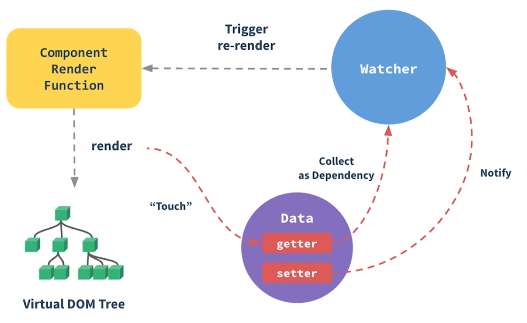

::: tip

Vue在实例化的时候会对 data 下的数据做一些 getter setter 的转化(说直白点就是对数据做了一个中间代理层)

:::

### 如何优雅地获取跨层级组件实例（拒绝递归）

## 生命周期函数 ​ :hammer:

::: tip 生命周期函数

生命周期函数就是Vue实例在某一个时间点会自动执行的函数

:::

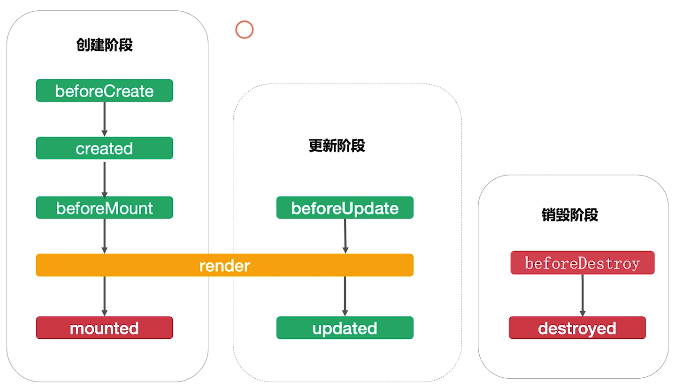

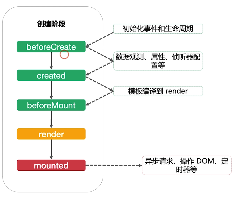

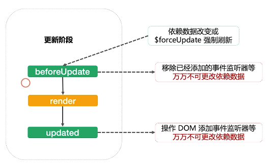

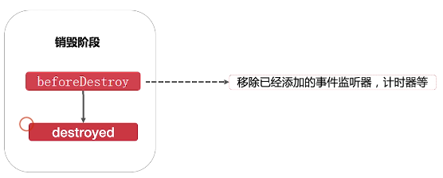


### 自定义指令

::: tip 自定义指令

- `bind`：只调用一次，指令第一次绑定到元素时调用。在这里可以进行一次性的初始化设置。
- `inserted`：被绑定元素插入父节点时调用 (仅保证父节点存在，但不一定已被插入文档中)。
- `update`：所在组件的 VNode 更新时调用，**但是可能发生在其子 VNode 更新之前**。指令的值可能发生了改变，也可能没有。但是你可以通过比较更新前后的值来忽略不必要的模板更新 (详细的钩子函数参数见下)。
- `componentUpdated`：指令所在组件的 VNode **及其子 VNode** 全部更新后调用。
- `unbind`：只调用一次，指令与元素解绑时调用。

:::

## 其他

### 常用高级特性（provide/inject）

平常业务开发中可能会很少用到，但是在 `开发底层通用组件` 使用频率就会相当高

### template和JSX的对比以及它们的本质

::: tip template

1. 模板语法（HTML的扩展）
2. 数据绑定使用Mustache语法（双大括号）

```html
<span>Message: {{msg}} </span>
```

:::

::: tip JSX

1. JavaScript的语法扩展
2. 数据绑定使用单引号

```html
<span>Message: {this.msg} </span>
```

:::

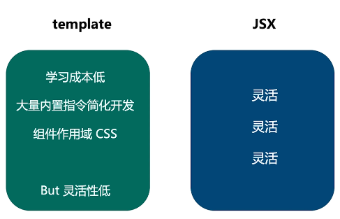

::: warning Vue官方文档

"更抽象一-点来看 ,我们可以把组件区分为两类:
一类是偏视图表现的(presentational) ,一 类则
是偏逻辑的(logical)。我们推荐在前者中使用模
板，在后者中使用JSX或渲染函数。这两类组件的
比例会根据应用类型的不同有所变化,但整体来说
我们发现表现类的组件远远多于逻辑类组件。"
:::

