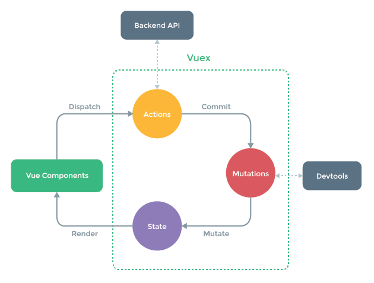

vuex

## Vuex :hammer:

[Vue官方文档](https://vuex.vuejs.org/zh/)

::: tip

如果没有异步的操作，其实是可以直接由 `组件(Vue Components)` Commit 到 Mutations

:::

### 核心概念

::: tip 核心概念

1. State一this. $store.state.xxx一mapState 取值
2. Getter-- this.$store.getters.xxx 一mapGetters 取值
3. Mutation一this. $store.commit( "xx”" )一mapMutations赋值
4. Action一this.$store.dispatch( "xxx" )一mapActions 赋值
5. Module

:::

::: tip 底层原理

1. State：提供-个响应式数据
2. Getter：借助Vue的计算属性computed来实现缓存
3. Mutation：更改state方法
4. Action：触发mutation方法
5. Module：Vue.set动态添加state到响应式数据中

:::

::: warning Module

- 开启命名空间namespaced: true
- 嵌套模块不要过深,尽量扁平化
- 灵活应用 createNamespacedHelpers

:::

